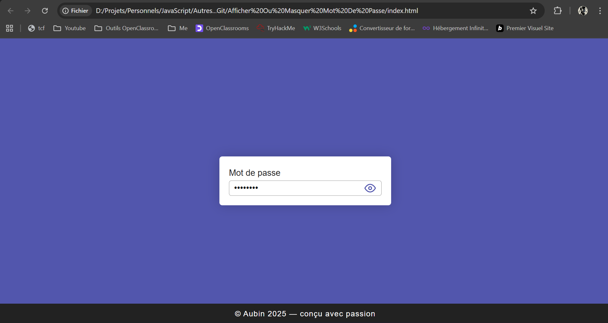
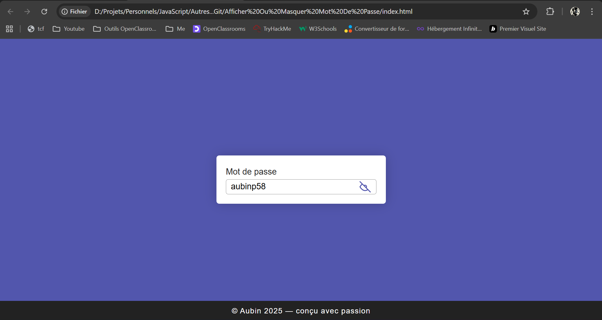

# Masquer-texte.
Petit projet en HTML, CSS et JavaScript permettant de masquer ou afficher le contenu d’une zone de texte avec une icône.

# Zone de texte masquable:

Un petit projet web qui permet de *masquer ou afficher le contenu d'une zone de texte* grâce à une icône.  
Développé avec *HTML, CSS et JavaScript* uniquement (sans framework).

## Fonctionnalités:

- Zone de texte simple et intuitive;  
- Icône permettant d’*afficher ou masquer* le texte saisi;  
- Design léger et responsive;
- Facile à intégrer dans d'autres projets;

## Technologies utilisées:

- *HTML5* – structure de la page;  
- *CSS3* – mise en forme et styles;  
- *JavaScript* – gestion de l’affichage/masquage;

  ##  Captures d'écran:  

|  |  | .
